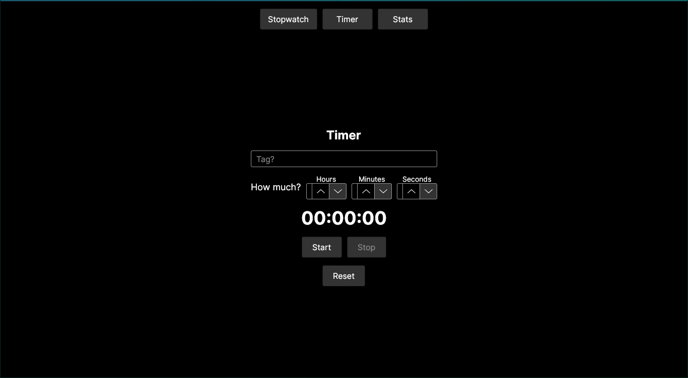
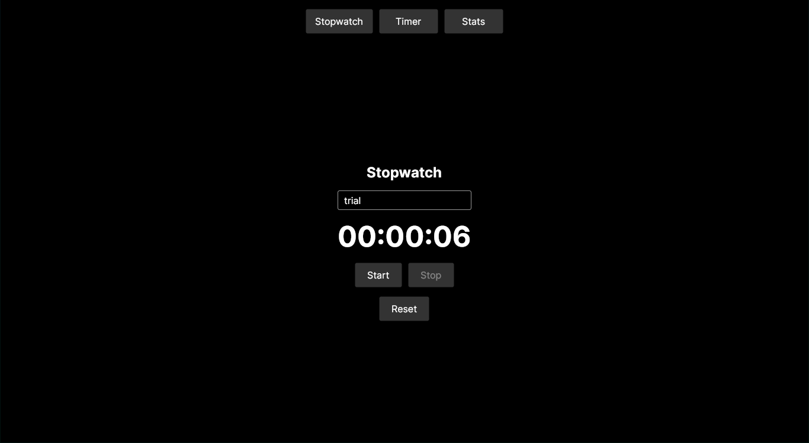
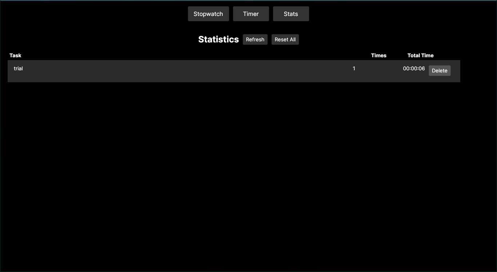

# TrackWatch

A simple cross-platform desktop time-tracking application built with .NET 8 and Avalonia UI.

## Features

- **Countdown Timer** - Set a duration for a named task and track time remaining
- **Stopwatch** - Count up from zero to measure task duration
- **Statistics Dashboard** - View aggregated stats for all tracked tasks (sessions count, total time)
- **Data Persistence** - All entries saved to a CSV log file

## Tech Stack

- **Language:** C# (.NET 8.0)
- **UI Framework:** Avalonia UI 11.3.12
- **MVVM Toolkit:** CommunityToolkit.Mvvm 8.2.1
- **Platform:** Windows, Linux, macOS

## Prerequisites

- .NET 8.0 SDK

## Usage

### Timer

1. Enter a task name
2. Set hours, minutes, and seconds
3. Click **Start** to begin countdown
4. Timer auto-saves when complete, or click **Stop** to save elapsed time

### Stopwatch

1. Enter a task name
2. Click **Start** to begin timing
3. Click **Stop** to save the elapsed time

### Statistics

- View all tracked tasks with session counts and total time
- **Refresh** - Reload stats from the log file
- **Delete** - Remove individual entries
- **Reset** - Clear all data
## Getting Started

### Build

```bash
dotnet build
```

### Run

```bash
dotnet run
```

### Publish

```bash
dotnet publish -c Release
```

## Data Storage

Time entries are persisted to `~/trackwatch.log` in CSV format:

```
tag,minutes,seconds
```

Each line represents one completed timer or stopwatch session.

## Project Structure

```
TrackWatch/
├── Program.cs                 # Application entry point
├── App.axaml                  # App configuration and theme setup
├── ViewLocator.cs             # ViewModel-to-View mapping
├── Models/
│   └── TimeEntry.cs           # Data model (Tag, Minutes, Seconds)
├── Services/
│   └── TimeService.cs         # File I/O for CSV log persistence
├── ViewModels/
│   ├── MainWindowViewModel.cs # Navigation and view management
│   ├── TimerViewModel.cs      # Countdown timer logic
│   ├── StopwatchViewModel.cs  # Stopwatch logic
│   └── StatsViewModel.cs      # Statistics aggregation
└── Views/
    ├── MainWindow.axaml       # Main window with navigation
    ├── TimerView.axaml        # Timer UI
    ├── StopwatchView.axaml    # Stopwatch UI
    └── StatsView.axaml        # Statistics dashboard
```

## Architecture

TrackWatch follows the **MVVM (Model-View-ViewModel)** pattern:

- **Models** - Data structures (`TimeEntry`)
- **Views** - Avalonia XAML UI files with compiled bindings
- **ViewModels** - State and logic using CommunityToolkit.Mvvm source generators (`[ObservableProperty]`, `[RelayCommand]`)
- **Services** - Static `TimeService` handles CSV file operations

Navigation is handled via a `ContentControl` that switches between views based on the active ViewModel.


## Screenshots

- 
- 
- 


## TODOs

- [ ] add dark/light theme toggle switch
- [ ] change upper bottons into tabs
- [ ] timer page bug: changing (hours, minutes, seconds) doesn't update/show the time lapse until you press start
